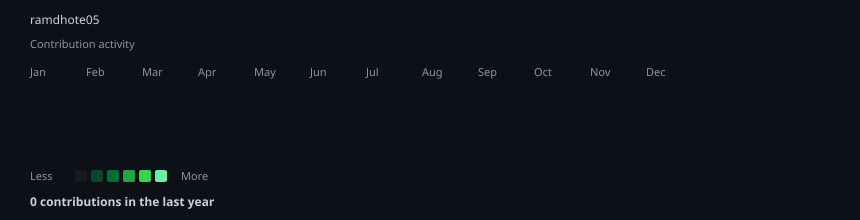

  

   

  

    

  
  
  
  

    

  
  

<h3><code>ramdhote05@github ~ $ whoami</code></h3>

<table>
  <tr>
    <td valign="top">
      <pre>
   ___   ___  _   _  ____  ____  _     _  ____   ____ 
  / _ \ / _ \/ | | |/ ___|/ ___|| |   | |/ ___| / ___|
 | | | | | | | | | | |  _| |    | |   | | |  _  \___ \
 | |_| | |_| | |_| | |_| | |___ | |___| | |_| |  ___) |
  \___/ \___/ \___/|_____|\____| |_____|_|_____| |____/
      </pre>
    </td>
    <td valign="top">
      

        I'm a Data Scientist and AI enthusiast focused on building intelligent solutions from data.
      

      <ul>
        <li>🧠 Data Science & Analytics</li>
        <li>🤖 Machine Learning & AI</li>
        <li>📈 Business intelligence & dashboards</li>
        <li>🐍 Python, SQL, forecasting, and experimentation</li>
      </ul>
    </td>
  </tr>
</table>

---

<h3><code>ramdhote05@github ~ $ ./stack.sh</code></h3>

  
  
  
  
  
  
  
  

---

<h3><code>ramdhote05@github ~ $ ./contributions.sh</code></h3>

---

<h3><code>ramdhote05@github ~ $ ./projects.sh</code></h3>

- 📊 Data analysis and exploratory research
- 🤖 ML and AI prototyping
- 📈 Forecasting and business analytics
- 🧩 Real-world problem solving with automation and insight

---

<h3><code>ramdhote05@github ~ $ ./stats.sh</code></h3>

  
  

---

<h3><code>ramdhote05@github ~ $ ./connect.sh</code></h3>

  
  

---

  
  

